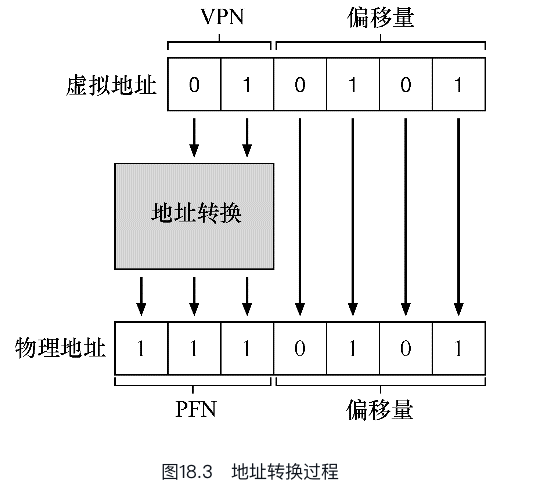

# 分页:介绍

操作系统有两种方法，来解决大多数空间管理问题。
- 第一种是将空间分割成不同长度的分片，就像虚拟内存管理中的分段。遗憾的是，这个解决方法存在固有的问题。具体来说，将空间切成不同长度的分片以后，空间本身会碎片化（fragmented），随着时间推移，分配内存会变得比较困难。

- 将空间分割成固定长度的分片。在虚拟内存中，我们称这种思想为分页，可以追溯到一个早期的重要系统，Atlas[KE+62, L78]。分页不是将一个进程的地址空间分割成几个不同长度的逻辑段（即代码、堆、段），而是分割成固定大小的单元，每个单元称为一页。相应地，我们把物理内存看成是定长槽块的阵列，叫作页帧（page frame）。每个这样的页帧包含一个虚拟内存页.

如何通过页来实现虚拟内存，从而避免分段的问题？基本技术是什么？如何让这些技术运行良好，并尽可能减少空间和时间开销？

## 一个简单的例子

一个只有64字节的小地址空间，有4个16字节的页

物理内存，如图18.2所示，也由一组固定大小的槽块组成。

也许操作系统保存了一个所有空闲页的空闲列表（free list），只需要从这个列表中拿出4个空闲

为了记录地址空间的每个虚拟页放在物理内存中的位置，操作系统通常为每个进程保存一个数据结构，称为页表（page table）。页表的主要作用是为地址空间的每个虚拟页面保存地址转换（address translation），从而让我们知道每个页在物理内存中的位置。

重要的是要记住，这个页表是一个每进程的数据结构

因此我们需要能够选择4个页，地址的前2位就是做这件事的。因此，我们有一个2位的虚拟页号（VPN）。其余的位告诉我们，感兴趣该页的哪个字节，在这个例子中是4位，我们称之为偏移量。

因此，我们可以通过用PFN替换VPN来转换此虚拟地址，然后将载入发送给物理内存（见图18.3）。请注意，偏移量保持不变（即未翻译），因为偏移量只是告诉我们页面中的哪个字节是我们想要的。我们的最终物理地址是1110101（十进制117），正是我们希望加载指令（见图18.2）获取数据的地方。



## 页表存在哪里?

页表可以变得非常大，比我们之前讨论过的小段表或基址/界限对要大得多。例如，想象一个典型的32位地址空间，带有4KB的页。这个虚拟地址分成20位的VPN和12位的偏移量（回想一下，1KB的页面大小需要10位，只需增加两位即可达到4KB）。一个20位的VPN意味着，操作系统必须为每个进程管理2^20个地址转换（大约一百万）。假设每个页表格条目（PTE）需要4个字节，来保存物理地址转换和任何其他有用的东西，每个页表就需要巨大的4MB内存！这非常大。现在想象一下有100个进程在运行：这意味着操作系统会需要400MB内存，只是为了所有这些地址转换！

由于页表如此之大，我们没有在MMU中利用任何特殊的片上硬件，来存储当前正在运行的进程的页表，而是将每个进程的页表存储在内存中

系统的进程控制块 PCB 中有一个字段,就存储页表.换句话说,系统为每一个进程设置了一个页表.

## 页表中到底有什么?

页表就是一种数据结构，用于将虚拟地址（或者实际上，是虚拟页号）映射到物理地址（物理帧号）。

最简单的形式称为线性页表（linear page table），就是一个数组。操作系统通过虚拟页号（VPN）检索该数组，并在该索引处查找页表项（PTE），以便找到期望的物理帧号（PFN）.找到 PFN 后,我们就相当于锁定了真实物理地址.


页表项PTE中有很多的东西:
- 保护位
- 有效位
- 存在位
- 参考位
- 等等


## 分页:也很慢

首先硬件必须知道当前正在运行的进程的页表的位置,现在让我们假设一个页表基址寄存器,它包含页表的起始物理位置.

为了找到某个页表项的位置,必须得找到页表的起始位置,假设我们从页表基址寄存器中拿到了页表的起始物理位置:PageTableBaseRegister

有了起始位置,我们通过虚拟地址再获取虚拟页号:
```Java
VPN     = (VirtualAddress & VPN_MASK) >> SHIFT
```

虚拟页码拿到后,就可以计算出页表项的位置.即:

```Java
VPN     = (VirtualAddress & VPN_MASK) >> SHIFT
PTEAddr = PageTableBaseRegister + (VPN * sizeof(PTE))
```

拿到了 PTEAddr后,就可立即查阅这个地址中的内容,比如查看PFN 等...


整个过程如下:
```Java
offset   = VirtualAddress & OFFSET_MASK
PhysAddr = (PFN << SHIFT) | offset
    // Extract the VPN from the virtual address
    VPN = (VirtualAddress & VPN_MASK) >> SHIFT

    // Form the address of the page-table entry (PTE)
    PTEAddr = PTBR + (VPN * sizeof(PTE))

    // Fetch the PTE
    PTE = AccessMemory(PTEAddr)

   // Check if process can access the page
   if (PTE.Valid == False)
       RaiseException(SEGMENTATION_FAULT)
   else if (CanAccess(PTE.ProtectBits) == False)
       RaiseException(PROTECTION_FAULT)
   else
       // Access is OK: form physical address and fetch it
       offset   = VirtualAddress & OFFSET_MASK
       PhysAddr = (PTE.PFN << PFN_SHIFT) | offset
       Register = AccessMemory(PhysAddr)
```

再梳理一下这个过程:
- 通过掩码计算出 offset(含在虚拟地址中);
- 通过掩码与以及右移直接计算出 VPN(含在虚拟地址中);
- 通过基址寄存器,计算出页表项的位置,相当于数组中某个单元的位置(物理地址);
- 访问这个物理地址,拿到 PTE;
- 访问 PTE 中的有效位,以及PFN;
- 结合 offset 计算出 PhysAddr;
- 访问真实物理地址,完成读写.

## 内存追踪

补充：数据结构——页表现代操作系统的内存管理子系统中最重要的数据结构之一就是页表（page table）。通常，页表存储虚拟—物理地址转换（virtual-to-physical address translation），从而让系统知道地址空间的每个页实际驻留在物理内存中的哪个位置。由于每个地址空间都需要这种转换，因此一般来说，系统中每个进程都有一个页表。页表的确切结构要么由硬件（旧系统）确定，要么由OS（现代系统）更灵活地管理。


