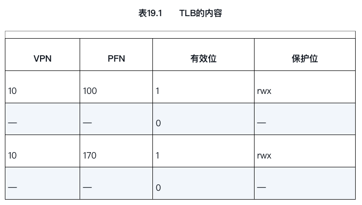
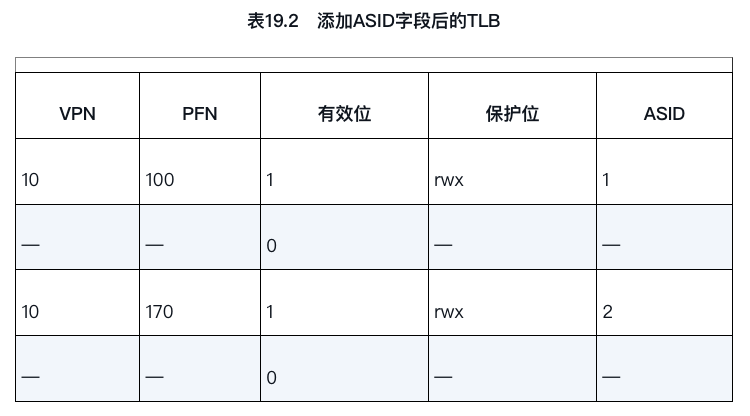
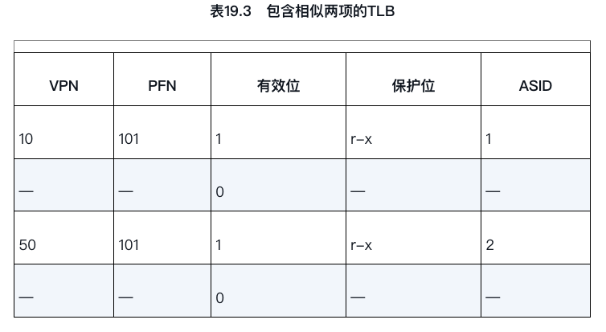

# 分页:快速地址转换

这些映射信息一般存储在物理内存中，所以在转换虚拟地址时，分页逻辑上需要一次额外的内存访问。每次指令获取、显式加载或保存，都要额外读一次内存以得到转换信息，这慢得无法接受.

## 关键问题：
如何加速地址转换如何才能加速虚拟地址转换，尽量避免额外的内存访问？需要什么样的硬件支持？操作系统该如何支持?

帮助常常来自操作系统的老朋友：硬件。我们要增加所谓的（由于历史原因[CP78]）地址转换旁路缓冲存储器（translation-lookaside buffer，TLB[CG68,C95]），它就是频繁发生的虚拟到物理地址转换的硬件缓存（cache）。因此，更好的名称应该是地址转换缓存（address-translation cache）。对每次内存访问，硬件先检查TLB，看看其中是否有期望的转换映射，如果有，就完成转换（很快），不用访问页表（其中有全部的转换映射）。TLB带来了巨大的性能提升，实际上，因此它使得虚拟内存成为可能.

## TLB 的基本算法

```Java
    VPN = (VirtualAddress & VPN_MASK) >> SHIFT
    (Success, TlbEntry) = TLB_Lookup(VPN)
    if (Success == True)    // TLB Hit
        if (CanAccess(TlbEntry.ProtectBits) == True)
            Offset   = VirtualAddress & OFFSET_MASK
            PhysAddr = (TlbEntry.PFN << SHIFT) | Offset
            AccessMemory(PhysAddr)
        else
            RaiseException(PROTECTION_FAULT)
   else    // TLB Miss
       PTEAddr = PTBR + (VPN * sizeof(PTE))
       PTE = AccessMemory(PTEAddr)
       if (PTE.Valid == False)
           RaiseException(SEGMENTATION_FAULT)
       else if (CanAccess(PTE.ProtectBits) == False)
           RaiseException(PROTECTION_FAULT)
       else
           TLB_Insert(VPN, PTE.PFN, PTE.ProtectBits)
           RetryInstruction()
```

硬件算法的大体流程如下：首先从虚拟地址中提取页号（VPN）（见图19.1第1行），然后检查TLB是否有该VPN的转换映射（第2行）。如果有，我们有了TLB命中（TLB hit），这意味着TLB有该页的转换映射。成功！接下来我们就可以从相关的TLB项中取出页帧号（PFN），与原来虚拟地址中的偏移量组合形成期望的物理地址（PA），并访问内存（第5～7行），假定保护检查没有失败（第4行）。

如果CPU没有在TLB中找到转换映射（TLB未命中），我们有一些工作要做。在本例中，硬件访问页表来寻找转换映射（第11～12行），并用该转换映射更新TLB（第18行），假设该虚拟地址有效，而且我们有相关的访问权限（第13、15行）。上述系列操作开销较大，主要是因为访问页表需要额外的内存引用（第12行）。最后，当TLB更新成功后，系统会重新尝试该指令，这时TLB中有了这个转换映射，内存引用得到很快处理。

因为TLB处理器核心附近，设计的访问速度很快。如果TLB未命中，就会带来很大的分页开销。必须访问页表来查找转换映射，导致一次额外的内存引用（或者更多，如果页表更复杂）。如果这经常发生，程序的运行就会显著变慢。相对于大多数CPU指令，内存访问开销很大，TLB未命中导致更多内存访问。因此，我们希望尽可能避免TLB未命中。

可以看到,这个缓存越大越快,但是对应的成本就越高.

## 示例:访问数组

关于TLB性能还有最后一点：如果在这次循环后不久，该程序再次访问该数组，我们会看到更好的结果，假设TLB足够大，能缓存所需的转换映射：命中、命中、命中、命中、命中、命中、命中、命中、命中、命中。在这种情况下，由于时间局部性（temporal locality），即在短时间内对内存项再次引用，所以TLB的命中率会很高。类似其他缓存，TLB的成功依赖于空间和时间局部性。如果某个程序表现出这样的局部性（许多程序是这样），TLB的命中率可能很高。

## 提示：尽可能利用缓存

缓存是计算机系统中最基本的性能改进技术之一，一次又一次地用于让“常见的情况更快”[HP06]。硬件缓存背后的思想是利用指令和数据引用的局部性（locality）。通常有两种局部性：时间局部性（temporal locality）和空间局部性（spatial locality）。时间局部性是指，最近访问过的指令或数据项可能很快会再次访问。想想循环中的循环变量或指令，它们被多次反复访问。空间局部性是指，当程序访问内存地址x时，可能很快会访问邻近x的内存。想想遍历某种数组，访问一个接一个的元素。

当然，这些性质取决于程序的特点，并不是绝对的定律，而更像是一种经验法则。硬件缓存，无论是指令、数据还是地址转换（如TLB），都利用了局部性，在小而快的芯片内存储器中保存一份内存副本。

处理器可以先检查缓存中是否存在就近的副本，而不是必须访问（缓慢的）内存来满足请求。如果存在，处理器就可以很快地访问它（例如在几个CPU时钟内），避免花很多时间来访问内存（好多纳秒）。你可能会疑惑：既然像TLB这样的缓存这么好，为什么不做更大的缓存，装下所有的数据？可惜的是，这里我们遇到了更基本的定律，就像物理定律那样。

如果想要快速地缓存，它就必须小，因为光速和其他物理限制会起作用。大的缓存注定慢，因此无法实现目的。所以，我们只能用小而快的缓存。剩下的问题就是如何利用好缓存来提升性能。

## 谁来处理 TLB 未命中?

可能有两个答案：硬件或软件（操作系统）.


## 接下来讨论几个重要的细节

首先，这里的从陷阱返回指令稍稍不同于之前提到的服务于系统调用的从陷阱返回。在后一种情况下，从陷阱返回应该继续执行陷入操作系统之后那条指令，就像从函数调用返回后，会继续执行此次调用之后的语句。在前一种情况下，在从TLB未命中的陷阱返回后，硬件必须从导致陷阱的指令继续执行。这次重试因此导致该指令再次执行，但这次会命中TLB。

这很重要,因此,根据陷阱或异常的原因,系统在陷入内核时必须保存不同的程序计数器，以便将来能够正确地继续执行。

第二，在运行TLB未命中处理代码时，操作系统需要格外小心避免引起TLB未命中的无限递归。有很多解决方案，例如，可以把TLB未命中陷阱处理程序直接放到物理内存中 [它们没有映射过（unmapped），不用经过地址转换]。或者在TLB中保留一些项，记录永久有效的地址转换，并将其中一些永久地址转换槽块留给处理代码本身，这些被监听的（wired）地址转换总是会命中TLB。

硬件不需要对未命中做太多工作，它抛出异常，操作系统的未命中处理程序会负责剩下的工作。

## TLB 的内容

典型的TLB有32项、64项或128项，并且是全相联的（fully associative）。

基本上，这就意味着一条地址映射可能存在TLB中的任意位置，硬件会并行地查找TLB，找到期望的转换映射。

一条TLB项内容可能像下面这样：
　　
VPN ｜ PFN ｜ 其他位

注意，VPN和PFN同时存在于TLB中，因为一条地址映射可能出现在任意位置（用硬件的术语，TLB被称为全相联的（fully-associative）缓存）。硬件并行地查找这些项，看看是否有匹配。


补充：TLB的有效位!=页表的有效位

常见的错误是混淆TLB的有效位和页表的有效位。在页表中，如果一个页表项（PTE）被标记为无效，就意味着该页并没有被进程申请使用，正常运行的程序不应该访问该地址。

当程序试图访问这样的页时，就会陷入操作系统，操作系统会杀掉该进程。TLB的有效位不同，只是指出TLB项是不是有效的地址映射。

例如，系统启动时，所有的TLB项通常被初始化为无效状态，因为还没有地址转换映射被缓存在这里。一旦启用虚拟内存，当程序开始运行，访问自己的虚拟地址，TLB就会慢慢地被填满，因此有效的项很快会充满TLB。

TLB有效位在系统上下文切换时起到了很重要的作用，后面我们会进一步讨论。通过将所有TLB项设置为无效，系统可以确保将要运行的进程不会错误地使用前一个进程的虚拟到物理地址转换映射。

## 上下文切换时对 TLB 的处理

有了TLB，在进程间切换时（因此有地址空间切换），会面临一些新问题。具体来说，TLB中包含的虚拟到物理的地址映射只对当前进程有效，对其他进程是没有意义的。所以在发生进程切换时，硬件或操作系统（或二者）必须注意确保即将运行的进程不要误读了之前进程的地址映射。

这意味着,在发生进程切换时，硬件或操作系统（或二者）必须注意确保即将运行的进程不要误读了之前进程的地址映射。

为了更好地理解这种情况，我们来看一个例子。当一个进程（P1）正在运行时，假设TLB缓存了对它有效的地址映射，即来自P1的页表。对这个例子，假设P1的10号虚拟页映射到了100号物理帧。

在这个例子中，假设还有一个进程（P2），操作系统不久后决定进行一次上下文切换，运行P2。这里假定P2的10号虚拟页映射到170号物理帧。如果这两个进程的地址映射都在TLB中，TLB的内容如表19.1所示:



在上面的TLB中，很明显有一个问题：VPN 10被转换成了 PFN 100（P1）和PFN 170（P2），但硬件分不清哪个项属于哪个进程。所以我们还需要做一些工作，让TLB正确而高效地支持跨多进程的虚拟化。因此，关键问题是：进程切换时如何管理TLB的内容?

这个问题有一些可能的解决方案:

- 一种方法是在上下文切换时，简单地清空（flush）TLB，这样在新进程运行前TLB就变成了空的;
- 如果是软件管理TLB的系统，可以在发生上下文切换时，通过一条显式（特权）指令来完成。如果是硬件管理TLB，则可以在页表基址寄存器内容发生变化时清空TLB（注意，在上下文切换时，操作系统必须改变页表基址寄存器（PTBR）的值）。不论哪种情况，清空操作都是把全部有效位（valid）置为0，本质上清空了TLB。

- 每次进程运行，当它访问数据和代码页时，都会触发TLB未命中。如果操作系统频繁地切换进程，这种开销会很高.这种成本是不可接受的.

- 为了减少这种开销，一些系统增加了硬件支持，实现跨上下文切换的TLB共享。比如有的系统在TLB中添加了一个地址空间标识符（Address Space Identifier，ASID）。可以把ASID看作是进程标识符（Process Identifier，PID），但通常比PID位数少（PID一般32位，ASID一般是8位）。

- 如果仍以上面的TLB为例，加上 ASID，很清楚不同进程可以共享TLB了：只要ASID字段来区分原来无法区分的地址映射。表19.2展示了添加ASID字段后的TLB。



- 因此，有了地址空间标识符，TLB可以同时缓存不同进程的地址空间映射，没有任何冲突。当然，硬件也需要知道当前是哪个进程正在运行，以便进行地址转换，因此操作系统在上下文切换时，必须将某个特权寄存器设置为当前进程的ASID。



如果两个进程共享同一物理页（例如代码段的页），就可能出现这种情况。在上面的例子中，进程P1和进程P2共享101号物理页，但是P1将自己的10号虚拟页映射到该物理页，而P2将自己的50号虚拟页映射到该物理页。

共享代码页（以二进制或共享库的方式）是有用的，因为它减少了物理页的使用，从而减少了内存开销。

## TLB 替换策略

TLB和其他缓存一样，还有一个问题要考虑，即缓存替换（cache replacement）

一种常见的策略是替换最近最少使用（least-recently-used，LRU）的项。LRU尝试利用内存引用流中的局部性，假定最近没有用过的项，可能是好的换出候选项。另一种典型策略就是随机（random）策略，即随机选择一项换出去。

这种策略很简单，并且可以避免一种极端情况。例如，一个程序循环访问n+1个页，但TLB大小只能存放n个页。这时之前看似“合理”的LRU策略就会表现得不可理喻，因为每次访问内存都会触发TLB未命中，而随机策略在这种情况下就好很多。

## 实际系统的 TLB 表项


由于MIPS的TLB是软件管理的，所以系统需要提供一些更新TLB的指令。MIPS提供了4个这样的指令：TLBP，用来查找指定的转换映射是否在TLB中；TLBR，用来将TLB中的内容读取到指定寄存器中；TLBWI，用来替换指定的TLB项；TLBWR，用来随机替换一个TLB项。操作系统可以用这些指令管理TLB的内容。当然这些指令是特权指令，这很关键。如果用户程序可以任意修改TLB的内容，你可以想象一下会发生什么可怕的事情。

David Culler过去常常指出TLB是许多性能问题的源头，所以他来命名这个定律：Culler 定律（Culler’s Law）。


## 小结

TLB也不能满足所有的程序需求。具体来说，如果一个程序短时间内访问的页数超过了TLB中的页数，就会产生大量的TLB未命中，运行速度就会变慢。这种现象被称为超出TLB覆盖范围（TLB coverage），这对某些程序可能是相当严重的问题。


解决这个问题的一种方案是支持更大的页，把关键数据结构放在程序地址空间的某些区域，这些区域被映射到更大的页，使TLB的有效覆盖率增加。对更大页的支持通常被数据库管理系统（Database Management System，DBMS）这样的程序利用，它们的数据结构比较大，而且是随机访问。

访问TLB很容易成为CPU流水线的瓶颈，尤其是有所谓的物理地址索引缓存（physically-indexed cache）。有了这种缓存，地址转换必须发生在访问该缓存之前，这会让操作变慢。为了解决这个潜在的问题，人们研究了各种巧妙的方法，用虚拟地址直接访问缓存，从而在缓存命中时避免昂贵的地址转换步骤。像这种虚拟地址索引缓存（virtually-indexed cache）解决了一些性能问题，但也为硬件设计带来了新问题。

