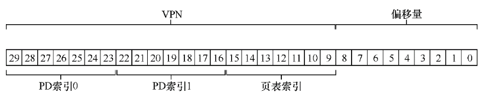

# 分页: 较小的表

我们现在来解决分页引入的第二个问题：页表太大，因此消耗的内存太多。

假设一个32位地址空间，假设一个页面大小为 4KB,这就要映射 2^20个页面,因此要有 2^20 个页表项.一个页表项 4 字节,也就是 4MB.

换句话说,一个进程就要消耗 4MB 的内存来存储页表,100个进程就要在理论上消耗 400MB 的内存空间来存储这些页表.


## 关键问题: 如何让页表更小？

简单的基于数组的页表（通常称为线性页表）太大，在典型系统上占用太多内存。如何让页表更小？关键的思路是什么？由于这些新的数据结构，会出现什么效率影响？

## 简单的解决方案: 更大的页

如果一个页面 16KB,那么只需要建立 2^16 个页表项,每个页表项仍然 4B,那么只需要 1MB,为原来的 25%.

### 页面太大会有什么问题?

会产生相当多的内部碎片.

因此，大多数系统在常见的情况下使用相对较小的页大小：4KB（如x86）或8KB（如SPARCv9）。问题不会如此简单地解决。

## 混合方法: 分页和分段

具体来说，Dennis想到将分页和分段相结合，以减少页表的内存开销。更仔细地看看典型的线性页表，就可以理解为什么这可能有用。假设我们有一个地址空间，其中堆和栈的使用部分很小。例如，我们使用一个16KB的小地址空间和1KB的页（见图20.1）。该地址空间的页表如表20.1所示。


可以看到,一个页表中充满了无效的项,如果依然要保存这些项,那么页表将会很长.


这是一个微小的16KB地址空间。想象一下32位地址空间的页表和所有潜在的浪费空间！真的，不要想象这样的事情，太可怕了,,哈哈哈哈哈

因此,我们的杂合方法不是为进程的整个地址空间提供单个页表，而是为每个逻辑分段提供一个。在这个例子中，我们可能有3个页表，地址空间的代码、堆和栈部分各有一个.

如果不为整个地址空间建立页表,那么就好办多了.可以将页表变得很短.

在杂合方案中，我们仍然在MMU中拥有这些结构。在这里，我们使用基址不是指向段本身，而是保存该段的页表的物理地址。界限寄存器用于指示页表的结尾（即它有多少有效页）。

### 一个例子

我们通过一个简单的例子来澄清。假设32位虚拟地址空间包含4KB页面，并且地址空间分为 4 个段。在这个例子中，我们只使用 3 个段：一个用于代码，另一个用于堆，还有一个用于栈。要确定地址引用哪个段，我们会用地址空间的前两位。假设00是未使用的段，01是代码段，10是堆段，11是栈段。因此，虚拟地址如下所示：


在硬件中，假设有3个基本/界限对，代码、堆和栈各一个。当进程正在运行时，每个段的基址寄存器都包含该段的线性页表的物理地址。

因此，系统中的每个进程现在都有3个与其关联的页表。在上下文切换时，必须更改这些寄存器，以反映新运行进程的页表的位置。在TLB未命中时（假设硬件管理的TLB，即硬件负责处理TLB未命中），硬件使用分段位（SN）来确定要用哪个基址和界限对。

然后硬件将其中的物理地址与VPN结合起来，形成页表项（PTE）的地址：

```Java
SN           = (VirtualAddress & SEG_MASK) >> SN_SHIFT
VPN          = (VirtualAddress & VPN_MASK) >> VPN_SHIFT
AddressOfPTE = Base[SN] + (VPN * sizeof(PTE))

```

这段代码应该看起来很熟悉，它与我们之前在线性页表中看到的几乎完全相同。当然，唯一的区别是使用3个段基址寄存器中的一个，而不是单个页表基址寄存器。

杂合方案的关键区别在于，每个分段都有界限寄存器，每个界限寄存器保存了段中最大有效页的值。例如，如果代码段使用它的前3个页（0、1和2），则代码段页表将只有3个项分配给它，并且界限寄存器将被设置为3。内存访问超出段的末尾将产生一个异常，并可能导致进程终止。以这种方式，与线性页表相比，杂合方法实现了显著的内存节省。栈和堆之间未分配的页不再占用页表中的空间（仅将其标记为无效）。

### 潜在问题

如果有一个大而稀疏的堆，仍然可能导致大量的页表浪费。其次，这种杂合导致外部碎片再次出现。尽管大部分内存是以页面大小单位管理的，但页表现在可以是任意大小（是PTE的倍数）。

## 多级页表

另一种方法并不依赖于分段，但也试图解决相同的问题：

$如何去掉页表中的所有无效区域，而不是将它们全部保留在内存中？$

我们将这种方法称为多级页表（multi-level page table），因为它将线性页表变成了类似树的东西。这种方法非常有效，许多现代系统都用它（例如x86）。我们现在详细描述这种方法。

多级页表的基本思想很简单。
- 首先，将页表分成页大小的单元;
- 然后，如果整页的页表项（PTE）无效，就完全不分配该页的页表;


其次，如果仔细构建，页表的每个部分都可以整齐地放入一页中，从而更容易管理内存.

操作系统可以在需要分配或增长页表时简单地获取下一个空闲页。将它与一个简单的（非分页）线性页表相比[2]，后者仅是按VPN索引的PTE数组。用这样的结构，整个线性页表必须连续驻留在物理内存中。对于一个大的页表（比如4MB），找到如此大量的、未使用的连续空闲物理内存，可能是一个相当大的挑战。有了多级结构，我们增加了一个间接层（level of indirection），使用了页目录，它指向页表的各个部分。这种间接方式，让我们能够将页表页放在物理内存的任何地方。

### 多级页表的局限性

应该指出，多级页表是有成本的。在TLB未命中时，需要从内存加载两次，才能从页表中获取正确的地址转换信息（一次用于页目录，另一次用于PTE本身），而用线性页表只需要一次加载.

因此，多级表是一个时间—空间折中（time-space trade-off）的小例子。我们想要更小的表（并得到了），但不是没代价。尽管在常见情况下（TLB命中），性能显然是相同的，但TLB未命中时，则会因较小的表而导致较高的成本。

另一个明显的缺点是复杂性。无论是硬件还是操作系统来处理页表查找（在TLB未命中时），这样做无疑都比简单的线性页表查找更复杂。通常我们愿意增加复杂性以提高性能或降低管理费用。在多级表的情况下，为了节省宝贵的内存，我们使页表查找更加复杂。

## 详细的多级示例

设想一个大小为16KB的小地址空间，其中包含64个字节的页。因此，我们有一个14位的虚拟地址空间，VPN有8位，偏移量有6位。即使只有一小部分地址空间正在使用，线性页表也会有2^8（256）个项。图20.3展示了这种地址空间的一个例子。


虚拟页0和1用于代码，虚拟页4和5用于堆，虚拟页254和255用于栈:


我们有 256 个项,每个项 4 字节,因此我们的总的页表大小为 1KB.

每个页表有 64B,因此需要建立 16 个页才能存下这么多的目录项,每个页有 16*4B = 64B 大小.每个页存放 16 个页表项.

我们现在需要了解：如何获取VPN，并用它来首先索引到页目录中，然后再索引到页表的页中。

请记住，每个都是一组项。因此，我们需要弄清楚，如何为每个VPN构建索引。

### 我们首先索引到页目录

这个例子中的页表很小：256个项，分布在16个页上。页目录需要为页表的每页提供一个项。因此，它有16个项。

结果，我们需要4位VPN来索引目录。我们使用VPN的前4位，如下所示：


一旦从VPN中提取了页目录索引（简称PDIndex），我们就可以通过简单的计算来找到页目录项（PDE）的地址：

### PDEAddr = PageDirBase +（PDIndex×sizeof（PDE））

这就得到了这个目录项的地址.

如果页目录项标记为无效，则我们知道访问无效，从而引发异常。

注意,这个目录项本质上还是一个页表的开始地址.具体来说，我们现在必须从页目录项指向的页表的页中获取页表项（PTE）。要找到这个PTE，我们必须使用VPN的剩余位索引到页表的部分：


## PTEAddr = (PDE.PFN << SHIFT) + (PTIndex * sizeof(PTE))


请注意，从页目录项获得的页帧号（PFN）必须左移到位，然后再与页表索引组合，才能形成PTE的地址。

为了确定这一切是否合理，我们现在代入一个包含一些实际值的多级页表，并转换一个虚拟地址。让我们从这个例子的页目录开始（见表20.2的左侧）。

在该表中，可以看到每个页目录项（PDE）都描述了有关地址空间页表的一些内容。在这个例子中，地址空间里有两个有效区域（在开始和结束处），以及一些无效的映射。


在这个例子中，VPN 254和255（栈）包含有效的映射。希望从这个例子中可以看出，多级索引结构可以节省多少空间。在这个例子中，我们不是为一个线性页表分配完整的16页，而是分配3页：一个用于页目录，两个用于页表的具有有效映射的块。大型（32位或64位）地址空间的节省显然要大得多。

最后，让我们用这些信息来进行地址转换。这里是一个地址，指向VPN 254的第0个字节：0x3F80，或二进制的11 1111 1000 0000。

- 前四位是:1111, 指向最后一个目录项
- 下四位是:1110, 是页面中的倒数第二（第14个）条，并告诉我们虚拟地址空间的页254映射到物理页55。
- 通过连接PFN = 55（或十六进制0x37）和offset =000000，可以形成我们想要的物理地址，并向内存系统发出请求.
- PhysAddr =（PTE.PFN <<SHIFT）+ offset = 00 1101 1100 0000 = 0x0DC0。

你现在应该知道如何构建两级页表，利用指向页表页的页目录。但遗憾的是，我们的工作还没有完成。我们现在要讨论，有时两个页级别是不够的！

## 超过两级

在至今为止的例子中，我们假定多级页表只有两个级别：一个页目录和几页页表。在某些情况下，更深的树是可能的（并且确实需要）。

请记住我们构建多级页表的目标：使页表的每一部分都能放入一个页。到目前为止，我们只考虑了页表本身。

### 但是，如果页目录太大，该怎么办？

如果目录太大,这意味着光是目录就可能存几页.

在这个例子中，假设我们有一个30位的虚拟地址空间和一个小的（512字节）页。因此我们的虚拟地址有一个21位的虚拟页号和一个9位偏移量。

鉴于页大小为512字节，因此,需要 9 位来做offset.

并且假设PTE大小为4字节，你应该看到，可以在单个页上放入128个PTE。

当我们索引页表时，我们可以得出结论，我们需要VPN的最低有效位7位（log2 128）作为索引：


还剩下:30-7-9=14,也就是在2^14 个页,要映射这么多页,因为每一个目录页能映射 2^7 个页,因此光目录就需要 2^(14-7) = 128 页.

因此我们让多级页表的每一个部分放入一页目标失败了。

为了解决这个问题，我们为树再加一层，将页目录本身拆成多个页，然后在其上添加另一个页目录，指向页目录的页。我们可以按如下方式分割虚拟地址：




现在，当索引上层页目录时，我们使用虚拟地址的最高几位（图中的PD索引0）。该索引用于从顶级页目录中获取页目录项。如果有效，则通过组合来自顶级PDE的物理帧号和VPN的下一部分（PD索引1）来查阅页目录的第二级。最后，如果有效，则可以通过使用与第二级PDE的地址组合的页表索引来形成PTE地址。这会有很多工作。所有这些只是为了在多级页表中查找某些东西。

## 地址转换过程


从图中可以看到，在任何复杂的多级页表访问发生之前，硬件首先检查TLB。在命中时，物理地址直接形成，而不像之前一样访问页表。只有在TLB未命中时，硬件才需要执行完整的多级查找。在这条路径上，可以看到传统的两级页表的成本：两次额外的内存访问来查找有效的转换映射。

反向页表（Inverted Page Table）是计算机操作系统中用于管理虚拟内存的数据结构之一。虚拟内存是一种技术，它允许操作系统将部分数据从物理内存（RAM）移至磁盘上，从而扩展可用内存。反向页表与传统的页表（页表是用于映射虚拟地址到物理地址的数据结构）不同，它是一种更高效的方式来查找虚拟地址到物理地址的映射。

在传统页表中，每个进程都有自己的页表，用于将虚拟页映射到物理页。这意味着页表的大小取决于进程的虚拟地址空间的大小，对于大型进程来说，页表可能会非常大。反向页表解决了这个问题，它将物理页框（通常是物理内存的一部分）映射到虚拟页，而不是相反。这意味着只需为物理页框分配一个表项，而不是为每个虚拟页分配一个表项，这可以大大减小表的大小。

当需要查找虚拟地址到物理地址的映射时，反向页表通过查询物理页框号来执行这个操作，而不是遍历整个页表。这可以提高内存管理的效率，特别是在具有大量物理内存的系统中。

总之，反向页表是一种用于管理虚拟内存的数据结构，它通过将物理页框映射到虚拟页来提高内存管理的效率，特别是对于大型进程和系统。

页表只是数据结构。你可以对数据结构做很多疯狂的事情，让它们更小或更大，使它们变得更慢或更快。多层和反向页表只是人们可以做的很多事情的两个例子。

## 总结

我们现在已经看到了如何构建真正的页表。不一定只是线性数组，而是更复杂的数据结构。这样的页表体现了时间和空间上的折中（表格越大，TLB未命中可以处理得更快，反之亦然），因此结构的正确选择强烈依赖于给定环境的约束。

