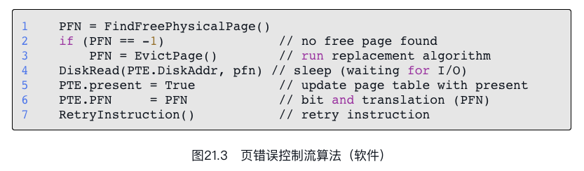

# 超越物理内存: 机制

到目前为止，我们一直假设所有页都常驻在物理内存中。但是，为了支持更大的地址空间，操作系统需要把当前没有在用的那部分地址空间找个地方存储起来。一般来说，这个地方有一个特点，那就是比内存有更大的容量。因此，一般来说也更慢（如果它足够快，我们就可以像使用内存一样使用，对吗？）。在现代系统中，硬盘（hard disk drive）通常能够满足这个需求。因此，在我们的存储层级结构中，大而慢的硬盘位于底层，内存之上。

不仅是一个进程，增加交换空间让操作系统为多个并发运行的进程都提供巨大地址空间的假象。多道程序（能够“同时”运行多个程序，更好地利用机器资源）的出现，强烈要求能够换出一些页，因为早期的机器显然不能将所有进程需要的所有页同时放在内存中。因此，多道程序和易用性都需要操作系统支持比物理内存更大的地址空间。这是所有现代虚拟内存系统都会做的事情，也是现在我们要进一步学习的内容。

## 交换空间

在操作系统中，一般这样的空间称为交换空间（swap space），因为我们将内存中的页交换到其中，并在需要的时候又交换回去。因此，我们会假设操作系统能够以页大小为单元读取或者写入交换空间。为了达到这个目的，操作系统需要记住给定页的硬盘地址（disk address）。

这个硬盘地址并不是随便设置的,也就是说,OS 会在特定的某个硬盘地址段用来专门设置 swap space.

不仅是一个进程，增加交换空间让操作系统为多个并发运行的进程都提供巨大地址空间的假象。多道程序（能够“同时”运行多个程序，更好地利用机器资源）的出现，强烈要求能够换出一些页，因为早期的机器显然不能将所有进程需要的所有页同时放在内存中。因此，多道程序和易用性都需要操作系统支持比物理内存更大的地址空间。这是所有现代虚拟内存系统都会做的事情.

## 存在位

硬件首先从虚拟地址获得VPN，检查TLB是否匹配（TLB命中），如果命中，则获得最终的物理地址并从内存中取回。这希望是常见情形，因为它很快（不需要额外的内存访问）。

如果在TLB中找不到VPN（即TLB未命中），则硬件在内存中查找页表（使用页表基址寄存器），并使用VPN查找该页的页表项（PTE）作为索引。如果页有效且存在于物理内存中，则硬件从PTE中获得PFN，将其插入TLB，并重试该指令，这次产生TLB命中。到现在为止还挺好。

当硬件在PTE中查找时，可能发现页不在物理内存中。硬件（或操作系统，在软件管理TLB时）判断是否在内存中的方法，是通过页表项中的一条新信息，即存在位（present bit）。如果存在位设置为1，则表示该页存在于物理内存中，并且所有内容都如上所述进行。如果存在位设置为零，则页不在内存中，而在硬盘上。访问不在物理内存中的页，这种行为通常被称为页错误（page fault）。

需要注意的是,这个错误对程序是透明的,当错误发生时,系统会执行错误处理程序,然后再次执行上一条命令.

## 页错误

在TLB未命中的情况下，我们有两种类型的系统：
- 硬件管理的TLB（硬件在页表中找到需要的转换映射）
- 软件管理的TLB（操作系统执行查找过程）。

不论在哪种系统中，如果页不存在，都由操作系统负责处理页错误。操作系统的页错误处理程序（page-fault handler）确定要做什么。几乎所有的系统都在软件中处理页错误。即使是硬件管理的TLB，硬件也信任操作系统来管理这个重要的任务。

## 所以问题是: 为什么硬件不能处理页错误

首先，页错误导致的硬盘操作很慢。即使操作系统需要很长时间来处理故障，执行大量的指令，但相比于硬盘操作，这些额外开销是很小的。

个人觉得这个原因更重要:为了能够处理页故障，硬件必须了解交换空间，如何向硬盘发起I/O操作，以及很多它当前所不知道的细节。

这就脱离了系统设计时的分层思想,这将会大大降低系统设计的可维护性以及拓展性.因此,能在高层实现的复杂,就尽量在高层实现,底层永远保持一个哲学:simple but reliable.

当硬盘I/O完成时，操作系统会更新页表，将此页标记为存在，更新页表项（PTE）的PFN字段以记录新获取页的内存位置，并重试指令。

## 内存满了怎么办?

内存可能已满（或接近满了）。因此，操作系统可能希望先交换出（page out）一个或多个页，以便为操作系统即将交换入的新页留出空间。选择哪些页被交换出或被替换（replace）的过程，被称为页交换策略（page-replacement policy）。

事实表明，人们在创建好页交换策略上投入了许多思考，因为换出不合适的页会导致程序性能上的巨大损失，也会导致程序以类似硬盘的速度运行而不是以类似内存的速度。

## 页错误处理流程

从图21.2的硬件控制流图中，可以注意到当TLB 未命中发生的时候有3种重要情景:
- 第一种情况，该页存在（present）且有效（valid）（第18～21行）。在这种情况下，TLB未命中处理程序可以简单地从PTE中获取PFN，然后重试指令（这次TLB会命中），并因此继续前面描述的流程。

- 第二种情况（第22～23行），页错误处理程序需要运行。虽然这是进程可以访问的合法页（毕竟是有效的），但它并不在物理内存中。此刻发生所谓的页错误.

- 第三种情况，访问的是一个无效页，可能由于程序中的错误（第13～14行）。在这种情况下，PTE中的其他位都不重要了。硬件捕获这个非法访问，操作系统陷阱处理程序运行，可能会杀死非法进程。

从图21.3的软件控制流中，可以看到为了处理页错误，操作系统大致做了什么:

- 首先，操作系统必须为将要换入的页找到一个物理帧，如果没有这样的物理帧，我们将不得不等待交换算法运行，并从内存中踢出一些页，释放帧供这里使用。

- 在获得物理帧后，处理程序发出I/O请求从交换空间读取页。最后，当这个慢操作完成时，操作系统更新页表并重试指令。重试将导致TLB未命中，然后再一次重试时，TLB命中，此时硬件将能够访问所需的值。

## 交换何时发生

为了保证有少量的空闲内存，大多数操作系统会设置高水位线（High Watermark，HW）和低水位线（Low Watermark，LW），来帮助决定何时从内存中清除页。

原理是这样：当操作系统发现有少于LW个页可用时，后台负责释放内存的线程会开始运行，直到有HW个可用的物理页。

这个后台线程有时称为交换守护进程（swap daemon）或页守护进程（page daemon）[1]，它然后会很开心地进入休眠状态，因为它毕竟为操作系统释放了一些内存。

## 小结

在这个简短的一章中，我们介绍了访问超出物理内存大小时的一些概念。要做到这一点，在页表结构中需要添加额外信息，比如增加一个存在位（present bit，或者其他类似机制），告诉我们页是不是在内存中。如果不存在，则操作系统页错误处理程序（page-fault handler）会运行以处理页错误（page fault），从而将需要的页从硬盘读取到内存，可能还需要先换出内存中的一些页，为即将换入的页腾出空间。

回想一下，很重要的是（并且令人惊讶的是），这些行为对进程都是透明的。对进程而言，它只是访问自己私有的、连续的虚拟内存。在后台，物理页被放置在物理内存中的任意（非连续）位置，有时它们甚至不在内存中，需要从硬盘取回。虽然我们希望在一般情况下内存访问速度很快，但在某些情况下，它需要多个硬盘操作的时间。像执行单条指令这样简单的事情，在最坏的情况下，可能需要很多毫秒才能完成。

正是这种透明性,使得进程简单起来.不然,,,,,那将是一场不敢想象的灾难.

