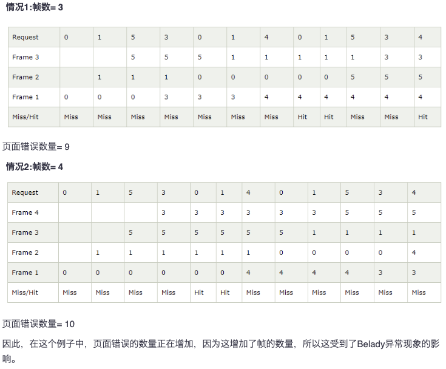
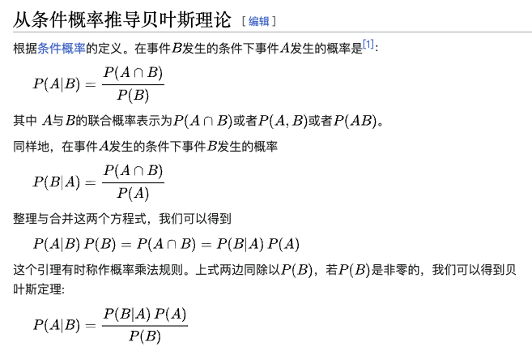
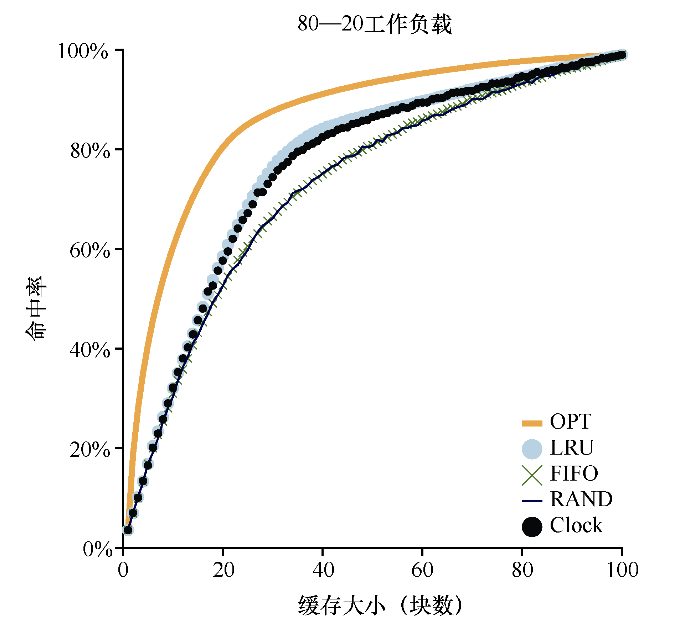

# 超越物理内存: 策略

在虚拟内存管理程序中，如果拥有大量空闲内存，操作就会变得很容易。页错误发生了，你在空闲页列表中找到空闲页，将它分配给不在内存中的页.

遗憾的是，当内存不够时事情会变得更有趣。在这种情况下，由于内存压力（memory pressure）迫使操作系统换出（paging out）一些页，为常用的页腾出空间。确定要踢出（evict）哪个页（或哪些页）封装在操作系统的替换策略（replacement policy）中。历史上，这是早期的虚拟内存系统要做的最重要的决定之一，因为旧系统的物理内存非常小。至少，有一些策略是非常值得了解的。因此我们的问题如下所示。

## 关键问题: 踢出哪一个页面?

这就是替换策略.

## 缓存管理

遗憾的是，正如你在这个例子中看到的，在现代系统中，磁盘访问的成本非常高，即使很小概率的未命中也会拉低正在运行的程序的总体AMAT。显然，我们必须尽可能地避免缓存未命中，避免程序以磁盘的速度运行。要做到这一点，有一种方法就是仔细开发一个聪明的策略，像我们现在所做的一样。

## 最有替换策略

为了更好地理解一个特定的替换策略是如何工作的，将它与最好的替换策略进行比较是很好的方法。事实证明，这样一个最优（optimal）策略是Belady多年前开发的[B66]（原来这个策略叫作MIN）。最优替换策略能达到总体未命中数量最少。Belady展示了一个简单的方法（但遗憾的是，很难实现！），即替换内存中在最远将来才会被访问到的页，可以达到缓存未命中率最低。

在LRU和最佳页面替换算法的情况下，可以看出，如果增加帧数，页面错误的数量将会减少。 然而，Balady发现，在FIFO页面替换算法中，随着帧数的增加页面错误的数量会增加。
在某些情况下，这是FIFO算法显示的奇怪行为。 这一个异常称为Belady异常。
我们来看看下面一个的例子:
引用字符串为:0 1 5 3 0 1 4 0 1 5 3 4 。分析两种情况下FIFO算法的行为。

遗憾的是，正如我们之前在开发调度策略时所看到的那样，未来的访问是无法知道的，你无法为通用操作系统实现最优策略[1]。因此，在开发一个真正的、可实现的策略时，我们将聚焦于寻找其他决定把哪个页面踢出的方法。因此，最优策略只能作为比较，知道我们的策略有多接近“完美”。

因此,我们可以通过这个最优策略来评价其它的算法,并把它当做一个标准尺度.

## FIFO

First in, first out.

对比FIFO和最优策略，FIFO明显不如最优策略.

FIFO会出现Belady 异常.

## 随机

另一个类似的替换策略是随机，在内存满的时候它随机选择一个页进行替换。随机具有类似于FIFO的属性。实现起来很简单，但是它在挑选替换哪个页时不够智能。

## LRU

最少最近使用(LRU)策略就是更具历史评价未来,本质上属于贝叶斯主义(德语:Bayesianismus),这是利用已知来推测未知.

正如你所看到的，像LRU这样的算法通常优于简单的策略（如FIFO或随机），它们可能会踢出重要的页。遗憾的是，基于历史信息的策略带来了一个新的挑战：应该如何实现呢？

遗憾的是，随着系统中页数量的增长，扫描所有页的时间字段只是为了找到最精确最少使用的页，这个代价太昂贵。想象一下一台拥有4GB内存的机器，内存切成4KB的页。这台机器有一百万页，即使以现代CPU速度找到LRU页也将需要很长时间

这就引出了一个问题：我们是否真的需要找到绝对最旧的页来替换？找到差不多最旧的页可以吗?

## 近似 LRU

事实证明，答案是肯定的：从计算开销的角度来看，近似LRU更为可行，实际上这也是许多现代系统的做法。这个想法需要硬件增加一个使用位（use bit，有时称为引用位，reference bit），这种做法在第一个支持分页的系统Atlas one-level store[KE + 62]中实现。系统的每个页有一个使用位，然后这些使用位存储在某个地方（例如，它们可能在每个进程的页表中，或者只在某个数组中）。每当页被引用（即读或写）时，硬件将使用位设置为1。但是，硬件不会清除该位（即将其设置为0），这由操作系统负责。

图22.5展示了时钟算法的一个变种的行为。该变种在需要进行页替换时随机扫描各页，如果遇到一个页的引用位为1，就清除该位（即将它设置为0）。直到找到一个使用位为0的页，将这个页进行替换。如你所见，虽然时钟算法不如完美的LRU做得好，但它比不考虑历史访问的方法要好。

时钟算法的置位,由 OS 来实现,硬件不去管它.

## 考虑脏位

这样做的原因是：如果页已被修改（modified）并因此变脏（dirty），则踢出它就必须将它写回磁盘，这很昂贵。如果它没有被修改（因此是干净的，clean），踢出就没成本。物理帧可以简单地重用于其他目的而无须额外的I/O。因此，一些虚拟机系统更倾向于踢出干净页，而不是脏页。

踢出干净页,这是在踢出 0标记 页的时候考虑的事情.

为了支持这种行为，硬件应该包括一个修改位（modified bit，又名脏位，dirty bit）。每次写入页时都会设置此位，因此可以将其合并到页面替换算法中。例如，时钟算法可以被改变，以扫描既未使用又干净的页先踢出。无法找到这种页时，再查找脏的未使用页面，等等。

## 其它虚拟内存策略

页面替换不是虚拟内存子系统采用的唯一策略（尽管它可能是最重要的）。例如，操作系统还必须决定何时将页载入内存。该策略有时称为页选择（page selection）策略（因为Denning这样命名[D70]），它向操作系统提供了一些不同的选项。

这意味着操作系统在页被访问时将页载入内存中，“按需”即可。当然，操作系统可能会猜测一个页面即将被使用，从而提前载入。这种行为被称为预取（prefetching），只有在有合理的成功机会时才应该这样做。例如，一些系统将假设如果代码页P被载入内存，那么代码页P + 1很可能很快被访问，因此也应该被载入内存。

另一个策略决定了操作系统如何将页面写入磁盘。

当然，它们可以简单地一次写出一个。然而，许多系统会在内存中收集一些待完成写入，并以一种（更高效）的写入方式将它们写入硬盘。

这种行为通常称为聚集（clustering）写入，或者就是分组写入（grouping），这样做有效是因为硬盘驱动器的性质，执行单次大的写操作，比许多小的写操作更有效。

## 抖动

在结束之前，我们解决了最后一个问题：当内存就是被超额请求时，操作系统应该做什么，这组正在运行的进程的内存需求是否超出了可用物理内存？在这种情况下，系统将不断地进行换页，这种情况有时被称为抖动（thrashing）[D70]。

某些版本的Linux会运行“内存不足的杀手程序（out-of-memory killer）”。这个守护进程选择一个内存密集型进程并杀死它，从而以不怎么委婉的方式减少内存。虽然成功地减轻了内存压力，但这种方法可能会遇到问题，例如，如果它杀死X服务器，就会导致所有需要显示的应用程序不可用。

## 小结

在许多情况下，由于内存访问和磁盘访问时间之间的差异增加，这些算法的重要性降低了。由于分页到硬盘非常昂贵，因此频繁分页的成本太高。所以，过度分页的最佳解决方案往往很简单：购买更多的内存。

