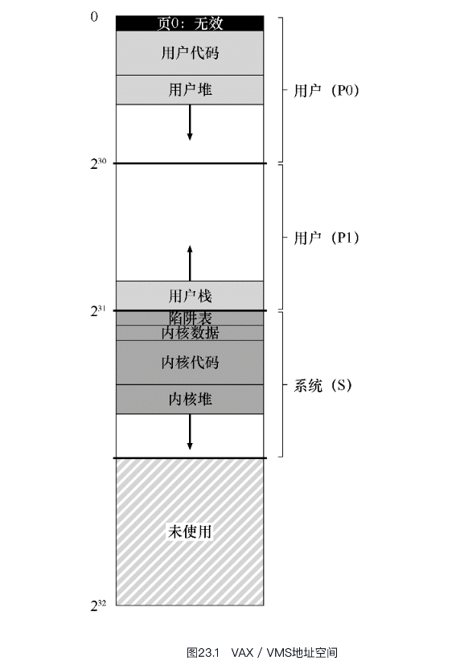

# VAX_VMS虚拟内存系统

让我们仔细研究一下VAX/VMS操作系统[LL82]的虚拟内存管理器，它特别干净漂亮。本章将讨论该系统，说明如何在一个完整的内存管理器中，将先前章节中提出的一些概念结合在一起。

## 背景

数字设备公司（DEC）在20世纪70年代末推出了VAX-11小型机体系结构.

该架构有许多实现，包括VAX-11/780和功能较弱的VAX-11/750。

VMS面临通用性的问题，即它将运行在各种机器上，包括非常便宜的VAXen（是的，这是正确的复数形式），以及同一架构系列中极高端和强大的机器。因此，操作系统必须具有一些机制和策略，适用于这一系列广泛的系统（并且运行良好）。

因此 VAX 具有特殊的代表性,研究它的内存管理技术就很适合.

## 内存管理硬件

VAX-11为每个进程提供了一个32位的虚拟地址空间，分为512字节的页。因此，虚拟地址由23位VPN和9位偏移组成。此外，VPN的高两位用于区分页所在的段。因此，如前所述，该系统是分页和分段的混合体。

这意味着,VAX-11上面的程序大小不会超过 4GB,4GB 的大小对于当时来说,绝对够用.

2+21+9 构成了VAX-11的内存地址,分为两大部分.

地址空间的下半部分称为"进程空间",对于每一个进程都是唯一的.

在进程空间的前半部分(P0),有用户程序和向下增长的堆; 在进程空间的后半部分(P1),有向上增长的栈

在地址空间的上半部分,是系统空间,受保护的操作系统代码和数据驻留于此,操作系统以这种方式进行跨进程共享.

VMS 设计人员的一个关注点是 VAX 硬件中的页大小非常小(512 字节)这意味着,存放页表就需要很大的空间.由于历史原因选择的这种尺寸，存在一个根本性问题，即简单的线性页表过大。因此，VMS设计人员的首要目标之一是确保VMS不会用页表占满内存。

VAX通过两种方法来避免页表对于内存的压力.

首先,通过将用户地址空间分为两部分(P0,P1). VAX-11为每个进程的每个区域(P0,P1)提供了一个页表.

因此堆和栈之间没有使用的地址空间不需要页表空间.基址和界限寄存器的使用与你期望的一样。一个基址寄存器保存该段的页表的地址，界限寄存器保存其大小（即页表项的数量）。

其次,通过在内核虚拟内存中放置用户页表(P0,P1),操作系统进一步降低内存压力.

因此，在分配或增长页表时，内核在段S中分配自己的虚拟内存空间。如果内存受到严重压力，内核可以将这些页表的页面交换到磁盘，从而使物理内存可以用于其他用途。

## 一个真实的地址空间

```C
int *p = NULL; // set p = 0
*p = 10;      // try to store value 10 to virtual address 0

```
硬件试图在TLB中查找VPN（这里也是0），遇到TLB未命中。查询页表，并且发现VPN 0的条目被标记为无效。因此，我们遇到无效的访问，将控制权交给操作系统，这可能会终止进程（在UNIX系统上，会向进程发出一个信号，让它们对这样的错误做出反应。但是如果信号未被捕获，则会终止进程）。

例如，代码段永远不会从第0页开始。相反，该页被标记为不可访问，以便为检测空指针（null-pointer）访问提供一些支持。因此，设计地址空间时需要考虑的一个问题是对调试的支持，这正是无法访问的零页所提供的。

虚拟地址0通常被保留为操作系统和硬件的保留地址，用于处理空指针异常和内存访问错误。虚拟地址0并不是专门为了"空指针"而设定的，而是为了处理未初始化或非法指针引起的问题。

在许多操作系统中，当程序尝试访问虚拟地址0或者尝试使用空指针时，会触发一次"空指针异常"，这通常会导致程序终止或产生错误报告。这是一种保护机制，以防止程序无意中引起严重内存访问错误，从而提高了系统的稳定性。

因此，虚拟地址0的存在是为了安全性和稳定性考虑，而不是专门为了"为了空指针服务"而设定的。空指针异常的处理是操作系统和编程语言运行时系统的一部分，它们有助于检测和处理指针相关的错误。



也许更重要的是，内核虚拟地址空间（即其数据结构和代码）是每个用户地址空间的一部分。在上下文切换时，操作系统改变P0和P1寄存器以指向即将运行的进程的适当页表。但是，它不会更改S基址和界限寄存器，并因此将“相同的”内核结构映射到每个用户的地址空间。

内核映射到每个地址空间，这有一些原因。这种结构使得内核的运转更轻松。

如果内核完全位于物理内存中，那么将页表的交换页切换到磁盘是非常困难的。如果内核被赋予了自己的地址空间，那么在用户应用程序和内核之间移动数据将再次变得复杂和痛苦。通过这种构造（现在广泛使用），内核几乎就像应用程序库一样，尽管是受保护的。

系统数据和代码被设置为比用户数据和代码更高的保护级别。试图从用户代码访问这些信息，将会在操作系统中产生一个陷阱，并且（你猜对了）可能会终止违规进程。

## 页替换

VAX中的页表项（PTE）包含以下位：一个有效位，一个保护字段（4位），一个修改（或脏位）位，为OS使用保留的字段（5位），最后是一个物理帧号码（PFN）将页面的位置存储在物理内存中。敏锐的读者可能会注意到：没有引用位（no reference bit）！因此，VMS替换算法必须在没有硬件支持的情况下，确定哪些页是活跃的。

### 分段的 FIFO

为了解决这两个问题，开发人员提出了分段的FIFO（segmented FIFO）替换策略[RL81]。想法很简单：每个进程都有一个可以保存在内存中的最大页数，称为驻留集大小（Resident Set Size，RSS）。每个页都保存在FIFO列表中。当一个进程超过其RSS时，“先入”的页被驱逐。FIFO显然不需要硬件的任何支持，因此很容易实现。

如果另一个进程Q需要一个空闲页，它会从全局干净列表中取出第一个空闲页。但是，如果原来的进程P在回收之前在该页上出现页错误，则P会从空闲（或脏）列表中回收，从而避免昂贵的磁盘访问。这些全局二次机会列表越大，分段的FIFO算法越接近LRU.

### 页聚集

VMS采用的另一个优化也有助于克服VMS中的小页面问题。具体来说，对于这样的小页面，交换过程中的硬盘I/O可能效率非常低，因为硬盘在大型传输中效果更好。为了让交换I/O更有效，VMS增加了一些优化，但最重要的是聚集（clustering）。通过聚集，VMS将大批量的页从全局脏列表中分组到一起，并将它们一举写入磁盘（从而使它们变干净）。聚集用于大多数现代系统，因为可以在交换空间的任意位置放置页，所以操作系统对页分组，执行更少和更大的写入，从而提高性能.


## 其它漂亮的虚拟内存技巧

VMS有另外两个现在成为标准的技巧：按需置零和写入时复制。我们现在描述这些惰性（lazy）优化。

- 按需置零: 它会在页表中放入一个标记页不可访问的条目。如果进程读取或写入页，则会向操作系统发送陷阱。在处理陷阱时，操作系统注意到（通常通过页表项中“保留的操作系统字段”部分标记的一些位），这实际上是一个按需置零页。此时，操作系统会完成寻找物理页的必要工作，将它置零，并映射到进程的地址空间。如果该进程从不访问该页，则所有这些工作都可以避免，从而体现按需置零的好处。

- 如果操作系统需要将一个页面从一个地址空间复制到另一个地址空间，不是实际复制它，而是将其映射到目标地址空间，并在两个地址空间中将其标记为只读。如果两个地址空间都只读取页面，则不会采取进一步的操作，因此操作系统已经实现了快速复制而不实际移动任何数据。

但是，如果其中一个地址空间确实尝试写入页面，就会陷入操作系统。操作系统会注意到该页面是一个COW页面，因此（惰性地）分配一个新页，填充数据，并将这个新页映射到错误处理的地址空间。该进程然后继续，现在有了该页的私人副本。COW有用有一些原因。

当然，任何类型的共享库都可以通过写时复制，映射到许多进程的地址空间中，从而节省宝贵的内存空间。

在UNIX系统中，由于fork()和exec()的语义，COW更加关键。你可能还记得，fork()会创建调用者地址空间的精确副本。对于大的地址空间，这样的复制过程很慢，并且是数据密集的。更糟糕的是，大部分地址空间会被随后的exec()调用立即覆盖，它用即将执行的程序覆盖调用进程的地址空间。通过改为执行写时复制的fork()，操作系统避免了大量不必要的复制，从而保留了正确的语义，同时提高了性能。这简直泰裤辣!

## 小结

VAX-11 的内存管理具有成熟的借鉴意义.


