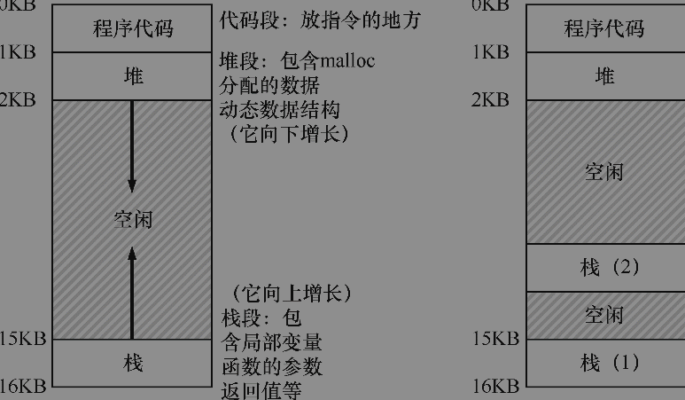

# 并发 介绍
经典观点是一个程序只有一个执行点（一个程序计数器，用来存放要执行的指令），但多线程（multi-threaded）程序会有多个执行点（多个程序计数器，每个都用于取指令和执行）。换一个角度来看，每个线程类似于独立的进程，只有一点区别：它们共享地址空间，从而能够访问相同的数据。

线程有一个程序计数器（PC），记录程序从哪里获取指令。每个线程有自己的一组用于计算的寄存器

线程之间的上下文切换有一点主要区别：地址空间保持不变（即不需要切换当前使用的页表）。

因此我们将此段代码称为临界区（critical section）。临界区是访问共享变量（或更一般地说，共享资源）的代码片段，一定不能由多个线程同时执行。

我们真正想要的代码就是所谓的互斥（mutual exclusion）。这个属性保证了如果一个线程在临界区内执行，其他线程将被阻止进入临界区。

我们要做的是要求硬件提供一些有用的指令，可以在这些指令上构建一个通用的集合，即所谓的同步原语（synchronization primitive）。通过使用这些硬件同步原语，加上操作系统的一些帮助，我们将能够构建多线程代码，以同步和受控的方式访问临界区，从而可靠地产生正确的结果——尽管有并发执行的挑战。很棒，对吗？

## 补充：关键并发术语

临界区、竞态条件、不确定性、互斥执行这4个术语对于并发代码来说非常重要，我们认为有必要明确地指出。 请参阅Dijkstra的一些早期著作[D65，D68]了解更多细节。

临界区（critical section）是访问共享资源的一段代码，资源通常是一个变量或数据结构。

竞态条件（race condition）出现在多个执行线程大致同时进入临界区时，它们都试图更新共享的数据结构，导致了令人惊讶的（也许是不希望的）结果。

不确定性（indeterminate）程序由一个或多个竞态条件组成，程序的输出因运行而异，具体取决于哪些线程在何时运行。这导致结果不是确定的（deterministic），而我们通常期望计算机系统给出确定的结果。

为了避免这些问题，线程应该使用某种互斥（mutual exclusion）原语。这样做可以保证只有一个线程进入临界区，从而避免出现竞态，并产生确定的程序输出

本章提出了并发问题，就好像线程之间只有一种交互，即访问共享变量，因此需要为临界区支持原子性。事实证明，还有另一种常见的交互，即一个线程在继续之前必须等待另一个线程完成某些操作。例如，当进程执行磁盘I/O并进入睡眠状态时，会产生这种交互。当I/O完成时，该进程需要从睡眠中唤醒，以便继续进行。因此，在接下来的章节中，我们不仅要研究如何构建对同步原语的支持来支持原子性，还要研究支持在多线程程序中常见的睡眠/唤醒交互的机制。如果现在不明白，没问题！当你阅读条件变量（condition variable）的章节时，很快就会发生。如果那时还不明白，那就有点问题了。你应该再次阅读本章（一遍又一遍），直到明白。

## 提示：使用原子操作

原子操作是构建计算机系统的最强大的基础技术之一，从计算机体系结构到并行代码（我们在这里研究的内容）、文件系统（我们将很快研究）、数据库管理系统，甚至分布式系统[L+93]。将一系列动作原子化（atomic）背后的想法可以简单用一个短语表达：“全部或没有”。看上去，要么你希望组合在一起的所有活动都发生了，要么它们都没有发生。不会看到中间状态。有时，将许多行为组合为单个原子动作称为事务（transaction），这是一个在数据库和事务处理世界中非常详细地发展的概念[GR92]。